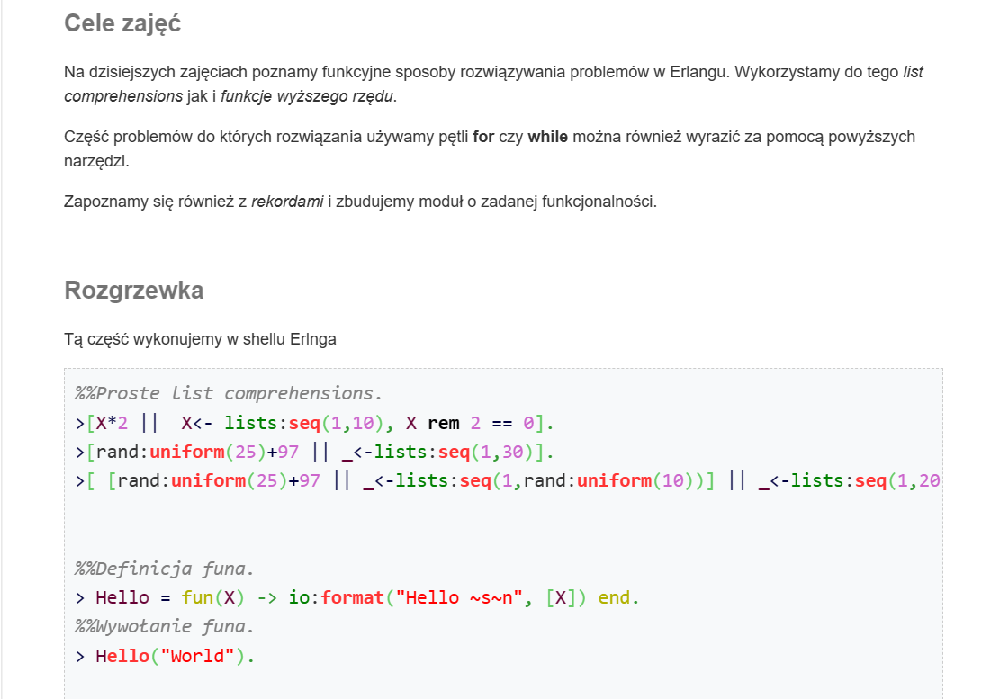
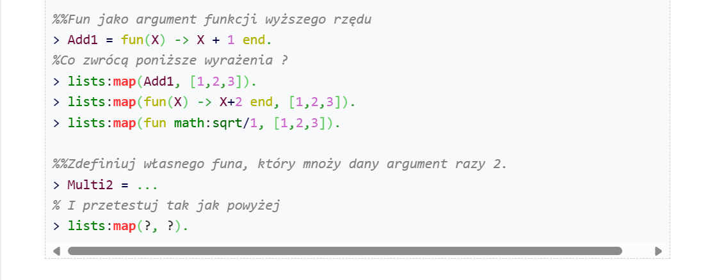
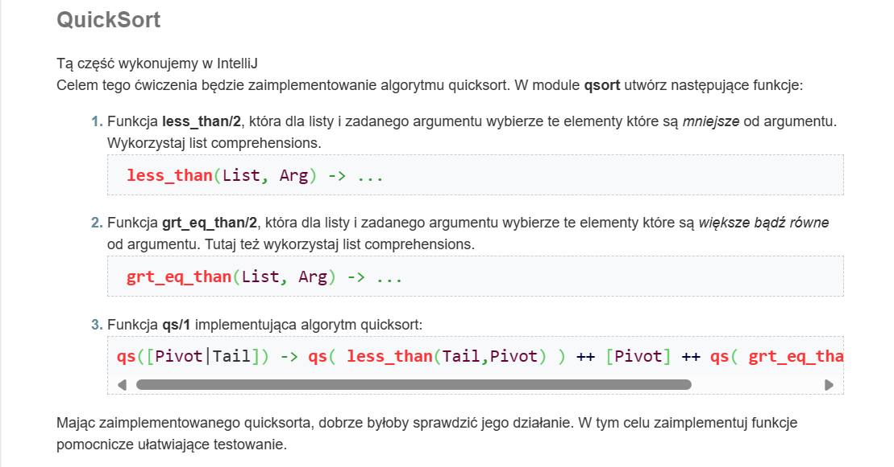
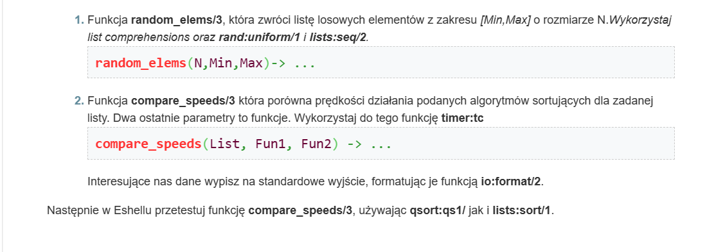
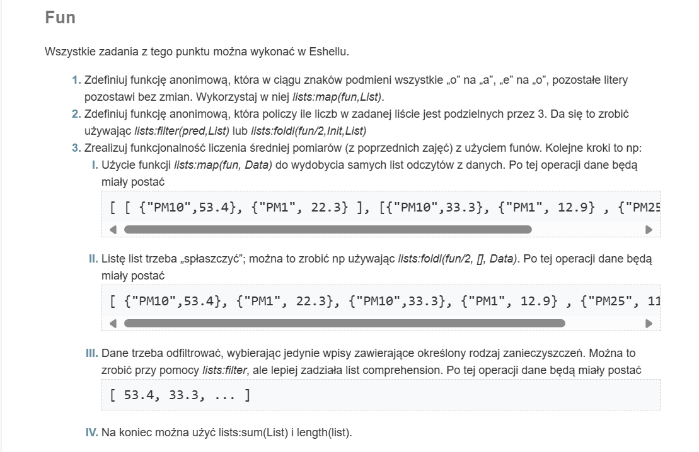
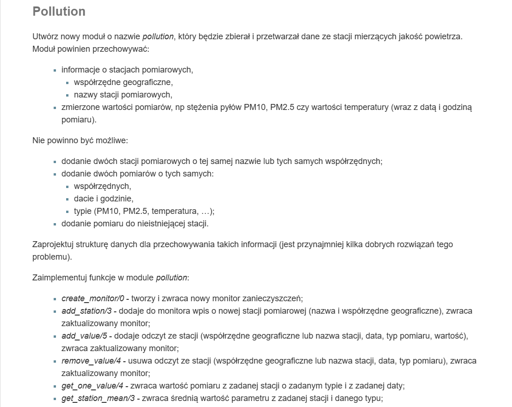
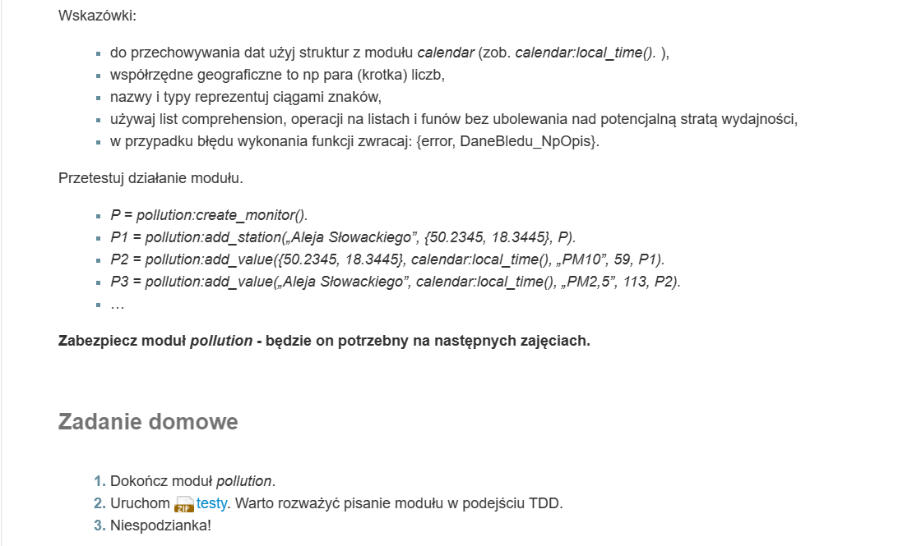

# Functional Programming in Erlang and Elixir
### AGH fourth term course expanding functional rpogramming via Erlang and Elixir. 

## Labs:
- #### Basics of Erlang

- #### Functional programming in Erlang 

